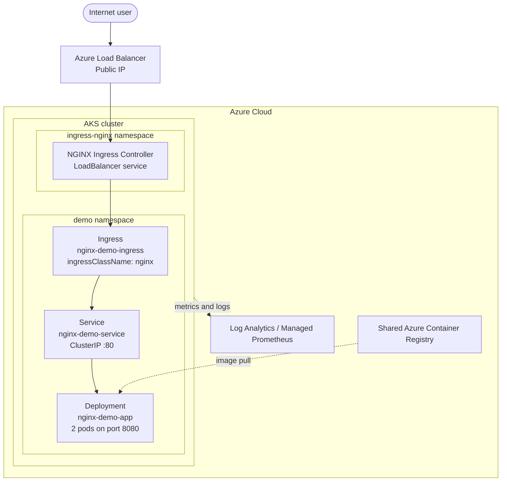

# NGINX Ingress Architecture

[Draw.io source](./architecture.drawio) | [Demo README](./README.md)

```mermaid
flowchart TD
    user([Internet user]) --> lb[Azure Load Balancer\nPublic IP]

    subgraph azure[Azure Cloud]
        subgraph aks[AKS cluster]
            subgraph ingressNs[ingress-nginx namespace]
                controller[NGINX Ingress Controller\nLoadBalancer service]
            end

            subgraph demoNs[demo namespace]
                ingress[Ingress\nnginx-demo-ingress\ningressClassName: nginx]
                service[Service\nnginx-demo-service\nClusterIP :80]
                pods[Deployment\nnginx-demo-app\n2 pods on port 8080]
            end
        end

        acr[Shared Azure Container Registry]
        logs[Log Analytics / Managed Prometheus]
    end

    lb --> controller
    controller --> ingress
    ingress --> service
    service --> pods
    acr -. image pull .-> pods
    aks -. metrics and logs .-> logs
```
