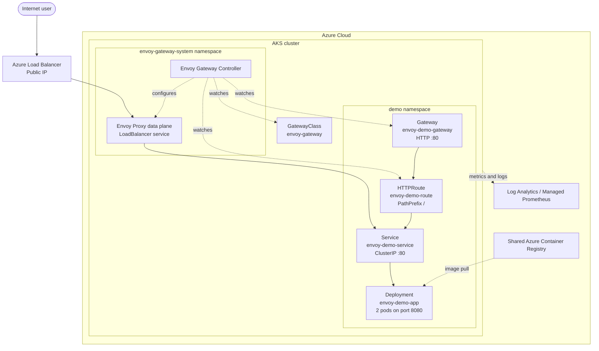

# Gateway API with Envoy Architecture

[Draw.io source](./architecture.drawio) | [Demo README](./README.md)

```mermaid
flowchart TD
    user([Internet user]) --> lb[Azure Load Balancer\nPublic IP]

    subgraph azure[Azure Cloud]
        subgraph aks[AKS cluster]
            subgraph envoyNs[envoy-gateway-system namespace]
                controller[Envoy Gateway Controller]
                proxy[Envoy Proxy data plane\nLoadBalancer service]
            end

            gatewayClass[GatewayClass\nenvoy-gateway]

            subgraph demoNs[demo namespace]
                gateway[Gateway\nenvoy-demo-gateway\nHTTP :80]
                route[HTTPRoute\nenvoy-demo-route\nPathPrefix /]
                service[Service\nenvoy-demo-service\nClusterIP :80]
                pods[Deployment\nenvoy-demo-app\n2 pods on port 8080]
            end
        end

        acr[Shared Azure Container Registry]
        logs[Log Analytics / Managed Prometheus]
    end

    lb --> proxy
    proxy --> service
    service --> pods

    controller -. watches .-> gatewayClass
    controller -. watches .-> gateway
    controller -. watches .-> route
    controller -. configures .-> proxy
    gateway --> route
    route --> service
    acr -. image pull .-> pods
    aks -. metrics and logs .-> logs
```
