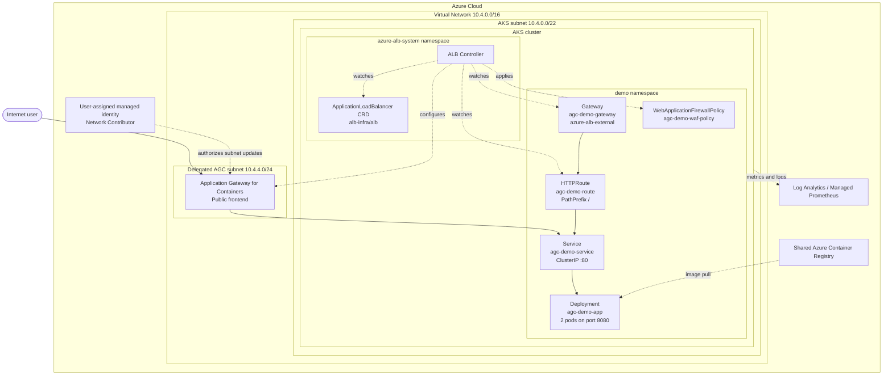

# Application Gateway for Containers Architecture

[Draw.io source](./architecture.drawio) | [Demo README](./README.md)

```mermaid
flowchart TD
    user([Internet user]) --> agc[Application Gateway for Containers\nPublic frontend]

    subgraph azure[Azure Cloud]
        subgraph vnet[Virtual Network 10.4.0.0/16]
            subgraph agcSubnet[Delegated AGC subnet 10.4.4.0/24]
                agc
            end

            subgraph aksSubnet[AKS subnet 10.4.0.0/22]
                subgraph aks[AKS cluster]
                    subgraph albNs[azure-alb-system namespace]
                        controller[ALB Controller]
                        albCrd[ApplicationLoadBalancer CRD\nalb-infra/alb]
                    end

                    subgraph demoNs[demo namespace]
                        gateway[Gateway\nagc-demo-gateway\nazure-alb-external]
                        route[HTTPRoute\nagc-demo-route\nPathPrefix /]
                        waf[WebApplicationFirewallPolicy\nagc-demo-waf-policy]
                        service[Service\nagc-demo-service\nClusterIP :80]
                        pods[Deployment\nagc-demo-app\n2 pods on port 8080]
                    end
                end
            end
        end

        identity[User-assigned managed identity\nNetwork Contributor]
        acr[Shared Azure Container Registry]
        logs[Log Analytics / Managed Prometheus]
    end

    agc --> service
    service --> pods

    controller -. watches .-> albCrd
    controller -. watches .-> gateway
    controller -. watches .-> route
    controller -. applies .-> waf
    controller -. configures .-> agc
    gateway --> route
    route --> service
    identity -. authorizes subnet updates .-> agc
    acr -. image pull .-> pods
    aks -. metrics and logs .-> logs
```
