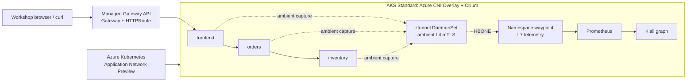

# Managed Istio Ambient Demo Architecture

```mermaid
flowchart LR
    user[Workshop browser / curl] --> gateway[Managed Gateway API\nGateway + HTTPRoute]
    gateway --> frontend[frontend]
    frontend --> orders[orders]
    orders --> inventory[inventory]

    subgraph aks[AKS Standard: Azure CNI Overlay + Cilium]
        frontend
        orders
        inventory
        ztunnel[ztunnel DaemonSet\nambient L4 mTLS]
        waypoint[Namespace waypoint\nL7 telemetry]
        prometheus[Prometheus]
        kiali[Kiali graph]
    end

    appnet[Azure Kubernetes\nApplication Network Preview] --> aks
    frontend -. ambient capture .-> ztunnel
    orders -. ambient capture .-> ztunnel
    inventory -. ambient capture .-> ztunnel
    ztunnel -. HBONE .-> waypoint
    waypoint --> prometheus --> kiali
```
