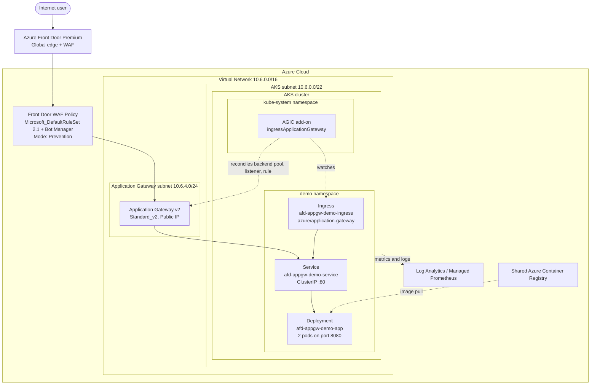

# Azure Front Door + Application Gateway Architecture

[Draw.io source](./architecture.drawio) | [Demo README](./README.md)

```mermaid
flowchart TD
    user([Internet user]) --> afd[Azure Front Door Premium\nGlobal edge + WAF]

    subgraph azure[Azure Cloud]
        waf[Front Door WAF Policy\nMicrosoft_DefaultRuleSet 2.1 + Bot Manager\nMode: Prevention]

        subgraph vnet[Virtual Network 10.6.0.0/16]
            subgraph agwSubnet[Application Gateway subnet 10.6.4.0/24]
                agw[Application Gateway v2\nStandard_v2, Public IP]
            end

            subgraph aksSubnet[AKS subnet 10.6.0.0/22]
                subgraph aks[AKS cluster]
                    subgraph kubeSystem[kube-system namespace]
                        agic[AGIC add-on\ningressApplicationGateway]
                    end

                    subgraph demoNs[demo namespace]
                        ingress[Ingress\nafd-appgw-demo-ingress\nazure/application-gateway]
                        service[Service\nafd-appgw-demo-service\nClusterIP :80]
                        pods[Deployment\nafd-appgw-demo-app\n2 pods on port 8080]
                    end
                end
            end
        end

        acr[Shared Azure Container Registry]
        logs[Log Analytics / Managed Prometheus]
    end

    afd --> waf
    waf --> agw
    agw --> service
    service --> pods

    agic -. reconciles backend pool, listener, rule .-> agw
    agic -. watches .-> ingress
    ingress --> service
    acr -. image pull .-> pods
    aks -. metrics and logs .-> logs
```
